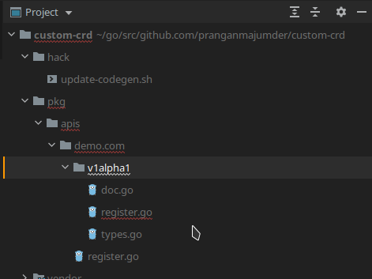

###### Workflow:
* create directory and file like that
   * Note: not custom-crd, it will be crd  

    
* run `go mod init && go mod tidy && go mod vendor`
* `cd hack/`
* change mod of file update-code.sh `chmod +x update-codegen.sh`
* `./update-codegen.sh`
    * it'll generate deepcopy funcs inside v1alpha1 folder & 'clientset , listers , informers ' inside auto generated client folder
  
* now run `make` after putting necessary rules into `Makefile`
  * it'll generate `crd` inside auto generated `config/crd/bases/` directory named `appscode.com_apployments.yaml`
  
* `kc apply -f appscode.com_apployments.yaml`
  * it'll generate the crd named `apployments.appscode.com` now create your custom yaml resource file 
  * apply custom object which you created apps-object/apployment.yaml manually `kc apply -f apployment.yaml` . 
  * It'll create apployment , run `kc get apployment`

## Running Controller


```sh
# assumes you have a working kubeconfig, not required if operating in-cluster
go build -o controller .
./controller -kubeconfig=$HOME/.kube/config

# create a CustomResourceDefinition
kubectl create -f config/crd/bases/appscode.com_apployments.yaml

# create a custom resource of type Foo
kubectl create -f apps-object/apployment.yaml

# check deployments created through the custom resource
kubectl get deployments
```


##### Error:
* `package github.com/googleapis/gnostic/OpenAPIv2: cannot find package` for this run `go get github.com/googleapis/gnostic@v0.4.0` inside directory `crd`